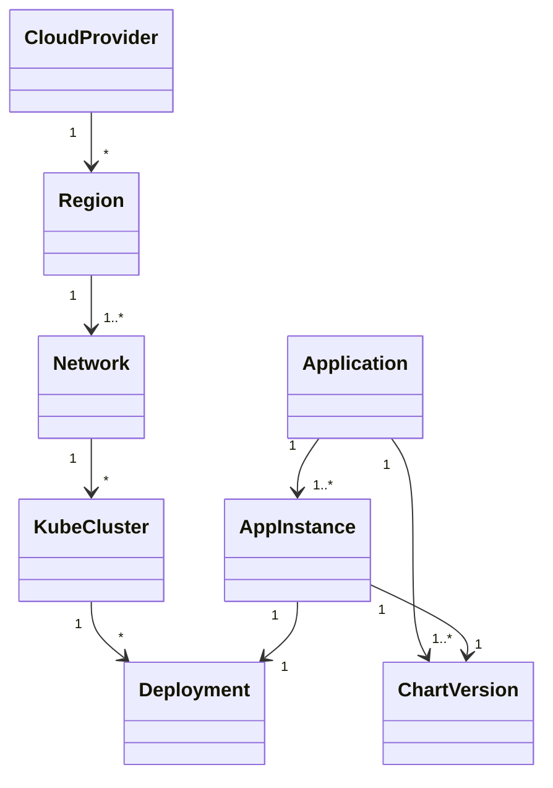
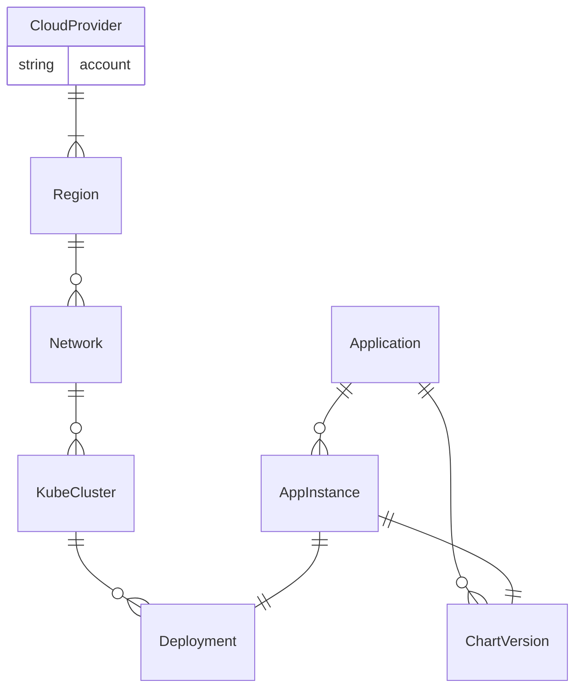
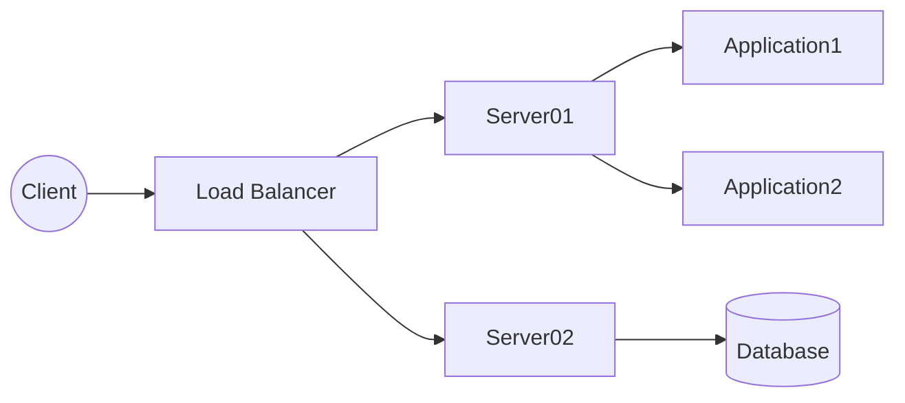
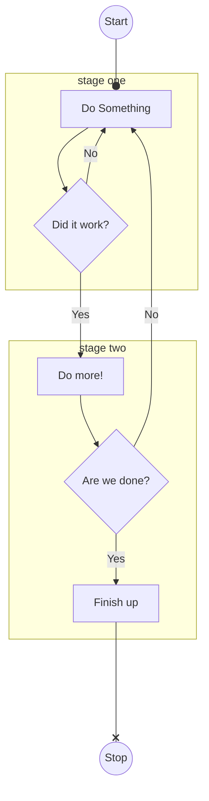
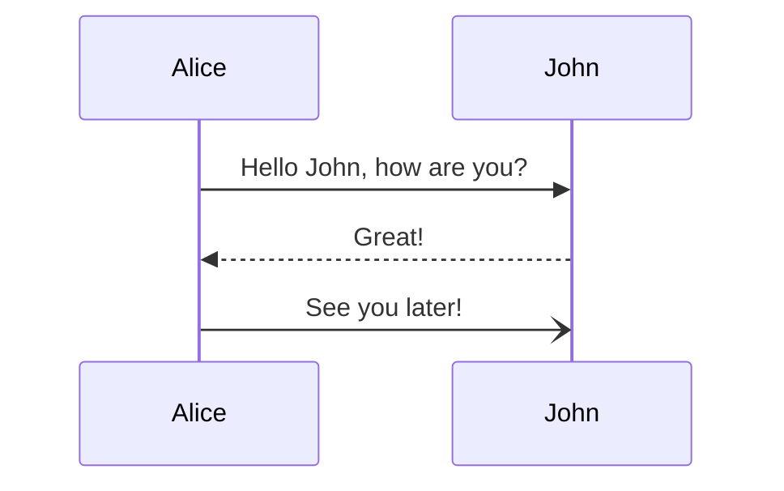
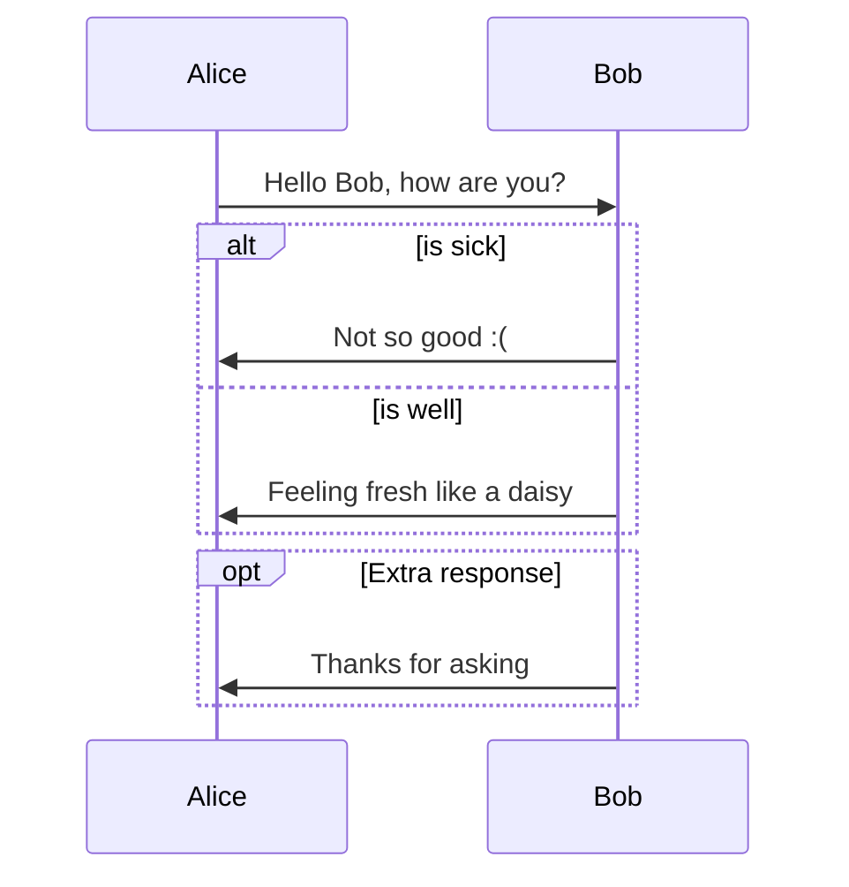
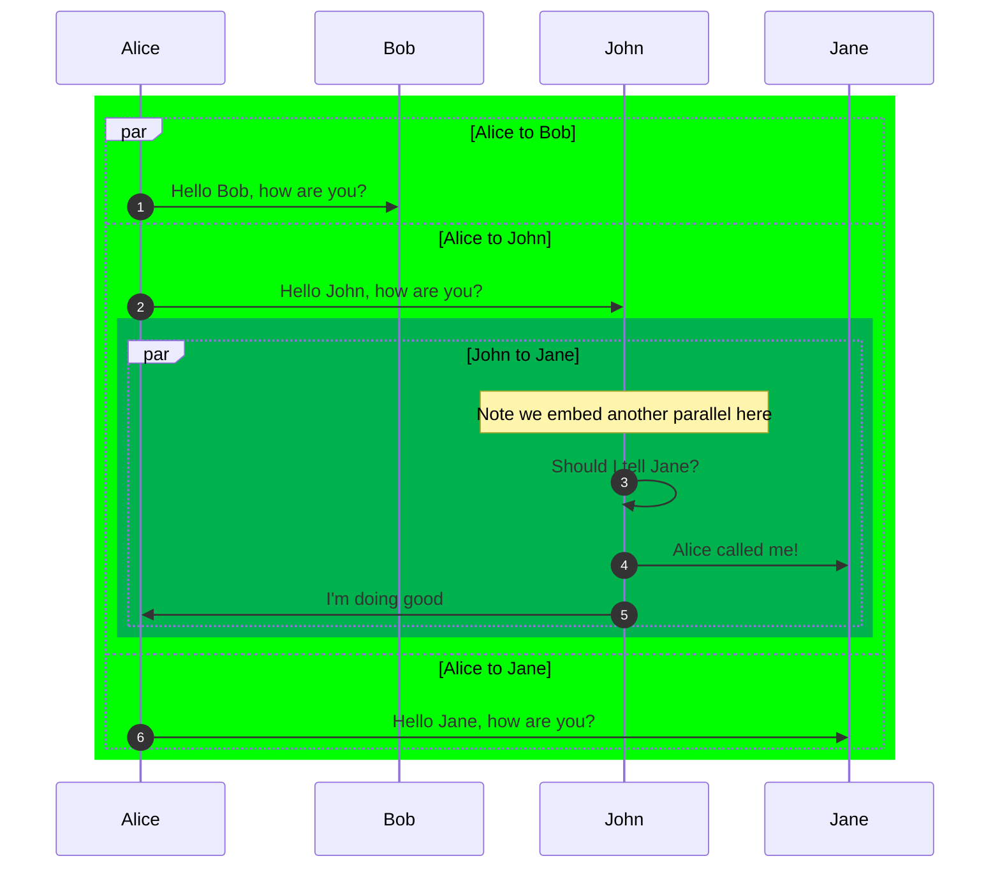
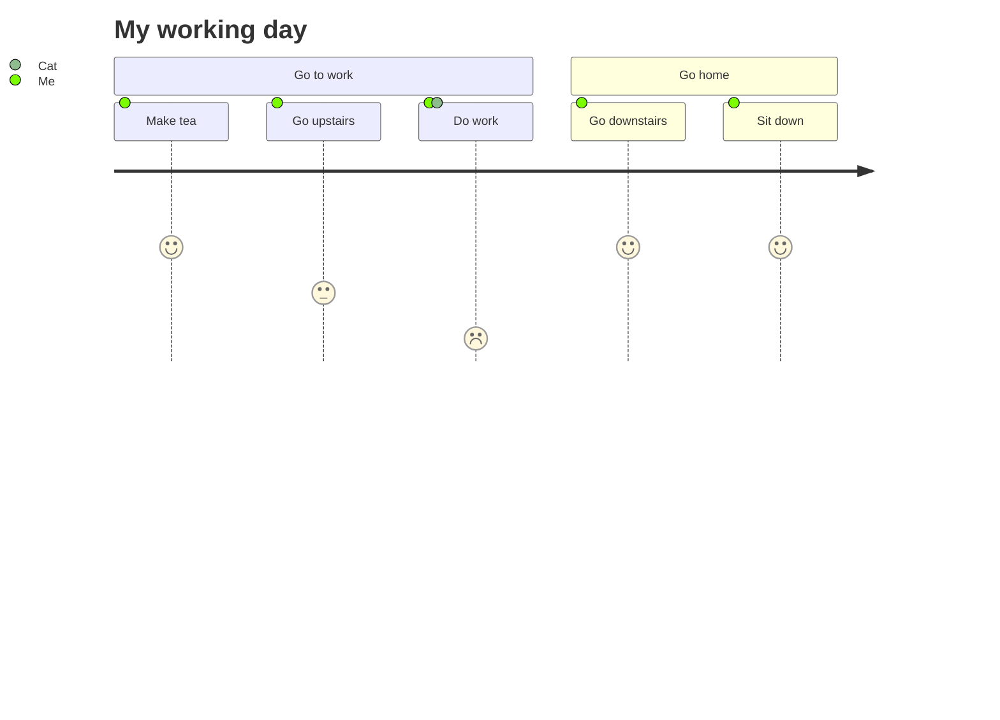
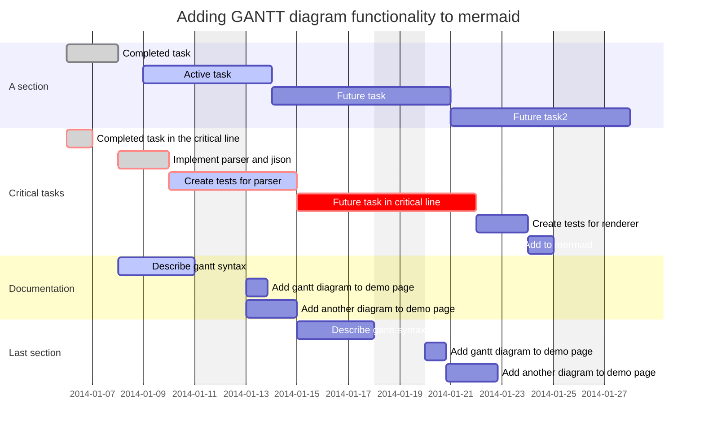
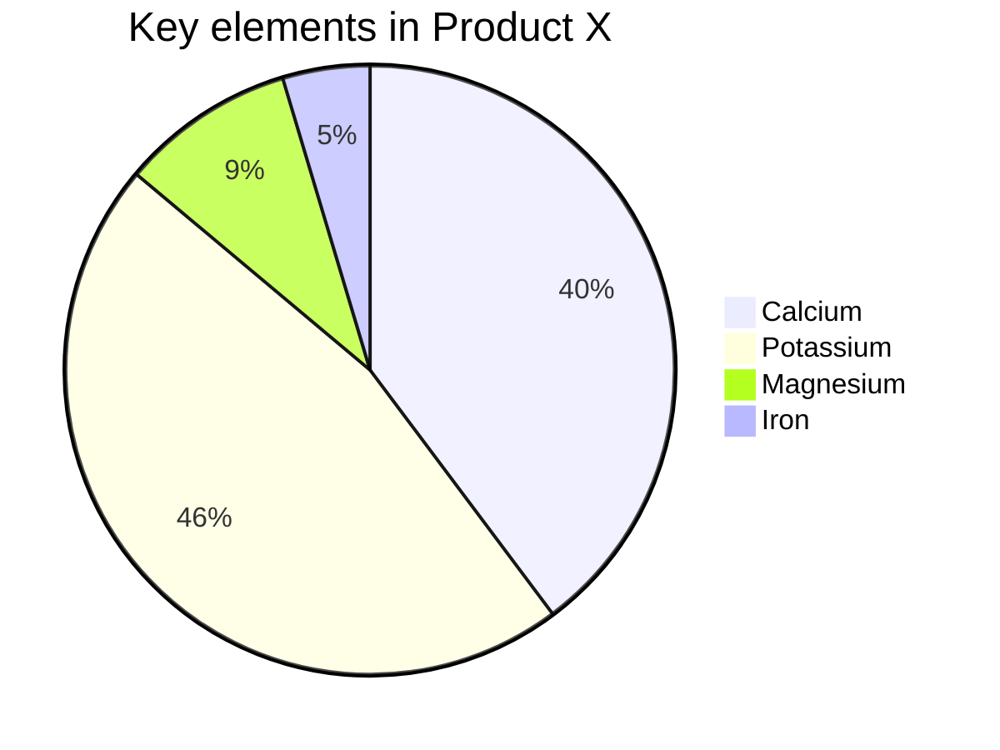

# References
* [How to get diagrams in MkDocs](https://chrieke.medium.com/the-best-mkdocs-plugins-and-customizations-fc820eb19759)
* [How to setup MkDocs on Mac and Github](https://suedbroecker.net/2021/01/25/how-to-install-mkdocs-on-mac-and-setup-the-integration-to-github-pages/)
* [Mermaid](https://mermaid-js.github.io/mermaid)
* [Mermaid2 plugin](https://github.com/fralau/mkdocs-mermaid2-plugin#declaring-the-superfences-extension)
* [Mermaid Live Editor](https://mermaid-js.github.io/mermaid-live-editor/#/edit/eyJjb2RlIjoiZ3JhcGggVERcbiAgICBBW0NocmlzdG1hc10gLS0-fEdldCBtb25leXwgQihHbyBzaG9wcGluZylcbiAgICBCIC0tPiBDe0xldCBtZSB0aGlua31cbiAgICBDIC0tPnxPbmV8IERbTGFwdG9wXVxuICAgIEMgLS0-fFR3b3wgRVtpUGhvbmVdXG4gICAgQyAtLT58VGhyZWV8IEZbZmE6ZmEtY2FyIENhcl0iLCJtZXJtYWlkIjp7InRoZW1lIjoiZGVmYXVsdCJ9LCJ1cGRhdGVFZGl0b3IiOmZhbHNlfQ)
* [Mermaid Diagram Syntax](https://mermaid-js.github.io/mermaid/#/flowchart?id=flowcharts-basic-syntax)

## Class or UML

Class Diagram:

The different cardinality options are:

| Value  | Meaning                        |
| :---:  | ----:                         |
| 1	     | Exactly one                   |
| 0..1	 | Zero or one                   |
| 1..*   | One or more (no upper limit)  |
| 0..n	 | Zero to n {where n>1}         |
| 1..n	 | One to n {where n>1}          |
| *      | Many                          |
| n      | n {where n>1}                 |
  

ER Diagram:

| Value (left) | Value (right) |Meaning                        |
| :---         | :---:         | ----:                         |
| &#124;o      | o&#124;	   | Zero or one                   |
| &#124;&#124;| &#124;&#124;   | Exactly one                   |
| }o	       | o{	           | Zero or more (no upper limit) |
| }&#124;      | &#124;{	   | One or more (no upper limit)  |

## Graph or Flowchart

## Sequence Diagram

Simple...

Complex....

More Complex....

## Journey

## Gantt Chart

## Pie Chart

