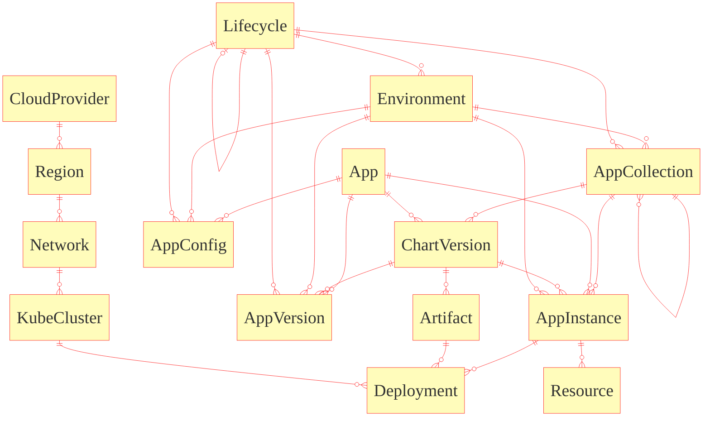

```mermaid
%%{init: {'theme': 'base', 'themeVariables': { 'primaryColor': '#fffcbb', 'fontFamily': 'aerial', 'fontSize': '50px', 'lineColor': '#ff0000', 'primaryBorderColor': '#ff0000'}}}%%
erDiagram
    AppCollection ||--o{ ChartVersion : ""
    AppCollection ||--o{ AppCollection : ""
    AppCollection ||--o{ AppInstance : ""
    AppInstance ||--o{ Deployment : ""
    AppInstance ||--o{ Resource : ""
    App ||--o{ AppConfig : ""
    App ||--o{ AppInstance : ""
    App ||--o{ AppVersion : ""
    App ||--o{ ChartVersion : ""
    Artifact ||--o{ Deployment : ""
    ChartVersion ||--o{ AppInstance : ""
    ChartVersion ||--o{ AppVersion : ""
    ChartVersion ||--o{ Artifact : ""
    CloudProvider ||--o{ Region : ""
    Environment ||--o{ AppCollection : ""    
    Environment ||--o{ AppConfig : ""
    Environment ||--o{ AppInstance : ""
    Environment ||--o{ AppVersion : ""
    KubeCluster ||--o{ Deployment : ""
    Lifecycle ||--o{ AppCollection : ""
    Lifecycle ||--o{ AppConfig : ""
    Lifecycle ||--o{ AppVersion : ""
    Lifecycle ||--o{ Environment : ""
    Lifecycle ||--o| Lifecycle : ""
    Network ||--o{ KubeCluster : ""
    Region ||--o{ Network : ""
```
